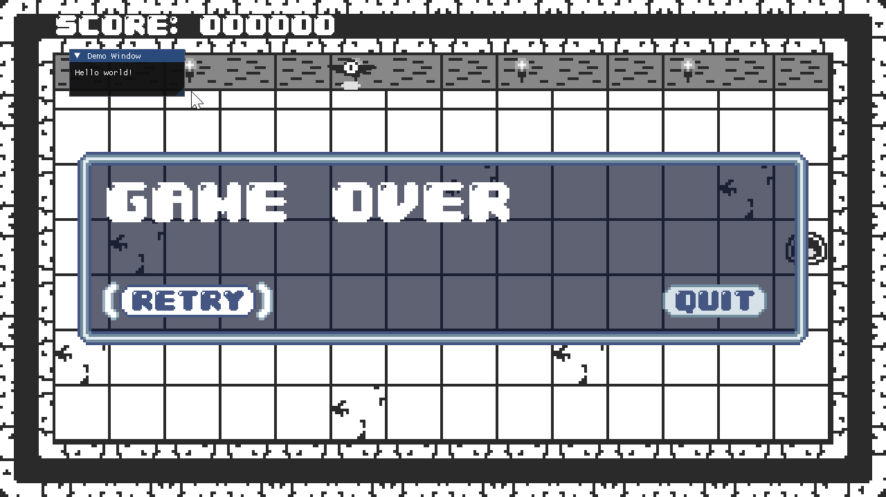

In the previous chapter, you set up a `Material` class to handle various quality of life features for working with shaders in MonoGame. In this chapter, we will continue developing the shader workflow by adding a _debug user interface_ for each `Material`. The UI will allow you to read and write shader parameters at runtime without needing to restart the game. 

## Adding a Debug UI Library

A common approach to building debug UI's in games is to use an _Immediate Mode_ system. An immediate mode UI redraws the entire UI from scratch every frame. Immediate mode UIs make developing developer-facing debug tools easy. A popular library is called `DearImGui`, which has a dotnet C# port called `ImGui.NET`. 

To add `ImGUI.NET`, add the following Nuget package reference to the _MonoGameLibrary_ project,
```xml
<PackageReference Include="ImGui.NET" Version="1.91.6.1" />
```

In order to render the `ImGui.NET` UI in MonoGame, we need a few supporting classes that convert the `ImGui.NET` data into MonoGame's graphical representation. There is a [sample project](https://github.com/ImGuiNET/ImGui.NET/tree/master/src/ImGui.NET.SampleProgram.XNA) on `ImGui.NET`'s public repository that we can copy for our use cases. 

Create a new folder in the _MonoGameLibrary_ project called _ImGui_ and copy paste the following files into the folder, 
- The [`ImGuiRenderer.cs`](https://github.com/ImGuiNET/ImGui.NET/blob/v1.91.6.1/src/ImGui.NET.SampleProgram.XNA/ImGuiRenderer.cs)
- The [`DrawVertDeclaration.cs`](https://github.com/ImGuiNET/ImGui.NET/blob/v1.91.6.1/src/ImGui.NET.SampleProgram.XNA/DrawVertDeclaration.cs)

There is `unsafe` code in the `ImGui` code, like this snippet, so you will need to enable `unsafe` code in the `MonoGameLibrary.csproj` file. Add this property.
```xml
<AllowUnsafeBlocks>true</AllowUnsafeBlocks>
```

In order to play around with the new UI tool, we will set up a simple _Hello World_ UI in the main `GameScene`. As we experiment with `ImGui`, we will build towards a re-usable debug UI for future shaders. To get started, we need to have an instance of `ImGuiRenderer`. Similar to how there is a single `static SpriteBatch` , we will create a single `static ImGuiRenderer` to be re-used throughout the game. 

In the `Core.cs` file, add the following property to the `Core` class.

```csharp
/// <summary>  
/// Gets the ImGui renderer used for debug UIs.  
/// </summary>  
public static ImGuiRenderer ImGuiRenderer { get; private set; }
```

And then to initialize the instance, in the `Initialize()` method, add the following snippet,
```csharp
// Create the ImGui renderer.  
ImGuiRenderer = new ImGuiRenderer(this);  
ImGuiRenderer.RebuildFontAtlas();
```

Similar to `SpriteBatch`'s `.Begin()` and `.End()` calls, the `ImGuiRenderer` has a start and end function call. In the `GameScene` class, add these lines to end of the `.Draw()` method.
```csharp
// Draw debug UI
Core.ImGuiRenderer.BeforeLayout(gameTime);  
// draw the debug UI here  
Core.ImGuiRenderer.AfterLayout();
```

`ImGui` draws by adding draggable windows to the screen. To create a simple window that just prints out `"Hello World"`, use the following snippet,
```csharp
// Draw debug UI  
Core.ImGuiRenderer.BeforeLayout(gameTime);  
ImGui.Begin("Demo Window");  
ImGui.Text("Hello world!");  
ImGui.End();  
Core.ImGuiRenderer.AfterLayout();
```

>[!tip]
>Don't forget to add a using statement at the top of the file for `using ImGuiNET;` 



## Building a Material Debug UI

Each instance of `Material` is going to draw a custom debug window. The window will show the latest time the shader was reloaded into the game, which will help demonstrate when a new shader is being used. The window can also show the parameter values for the shader. 

Add the following function to the `Material` class, 
```csharp

[Conditional("DEBUG")]
public void DrawDebug()
{
	ImGui.Begin(Effect.Name);
	
	var currentSize = ImGui.GetWindowSize();
	ImGui.SetWindowSize(Effect.Name, new System.Numerics.Vector2(MathHelper.Max(100, currentSize.X), MathHelper.Max(100, currentSize.Y)));
	
	ImGui.AlignTextToFramePadding();
	ImGui.Text("Last Updated");
	ImGui.SameLine();
	ImGui.LabelText("##last-updated", Asset.UpdatedAt.ToString() + $" ({(DateTimeOffset.Now - Asset.UpdatedAt).ToString(@"h\:mm\:ss")} ago)");

	ImGui.NewLine();


	bool ScalarSlider(string key, ref float value)
	{
		float min = 0;
		float max = 1;
		
		return ImGui.SliderFloat($"##_prop{key}", ref value, min, max);
	}
	
	foreach (var prop in ParameterMap)
	{
		switch (prop.Value.ParameterType, prop.Value.ParameterClass)
		{
			case (EffectParameterType.Single, EffectParameterClass.Scalar):
				ImGui.AlignTextToFramePadding();
				ImGui.Text(prop.Key);
				ImGui.SameLine();
							
				var value = prop.Value.GetValueSingle();
				if (ScalarSlider(prop.Key, ref value))
				{
					prop.Value.SetValue(value);
				}
				break;
			
			case (EffectParameterType.Single, EffectParameterClass.Vector):
				ImGui.AlignTextToFramePadding();
				ImGui.Text(prop.Key);

				var vec2Value = prop.Value.GetValueVector2();
				ImGui.Indent();
				
				ImGui.Text("X");
				ImGui.SameLine();
				
				if (ScalarSlider(prop.Key + ".x", ref vec2Value.X))
				{
					prop.Value.SetValue(vec2Value);
				}
				
				ImGui.Text("Y");
				ImGui.SameLine();
				if (ScalarSlider(prop.Key + ".y", ref vec2Value.Y))
				{
					prop.Value.SetValue(vec2Value);
				}
				ImGui.Unindent();
				break;
			
			case (EffectParameterType.Texture2D, EffectParameterClass.Object):
				ImGui.AlignTextToFramePadding();
				ImGui.Text(prop.Key);
				ImGui.SameLine();

				var texture = prop.Value.GetValueTexture2D();
				if (texture != null)
				{
					var texturePtr = Core.ImGuiRenderer.BindTexture(texture);
					ImGui.Image(texturePtr, new System.Numerics.Vector2(texture.Width, texture.Height));
				}
				else
				{
					ImGui.Text("(null)");
				}
				break;
			
			default:
				ImGui.AlignTextToFramePadding();
				ImGui.Text(prop.Key);
				ImGui.SameLine();
				ImGui.Text($"(unsupported {prop.Value.ParameterType}, {prop.Value.ParameterClass})");
				break;
		}
	}
	ImGui.End();
}
```

Now, run the game observe that the `Saturation` parameter can be seen interpolating from `1` to `0` when the game over screen appears.


However, if you try to interact with the slider to manually set the `Saturation`, your inputs will always be overridden, because the `GameScene` itself keeps setting the value. In order to solve this, we can introduce a custom property in the `Material` class that causes the debug UI to override the various `SetParameter()` methods. 

First, add this new boolean to the `Material` class.

```csharp
public bool DebugOverride;
```

Then, modify all of the `SetParameter()` methods to exit early when the `DebugOverride` variable is set to `true`. 
```csharp
public void SetParameter(string name, float value)
{
	if (DebugOverride) return;

	if (TryGetParameter(name, out var parameter))
	{
		parameter.SetValue(value);
	}
	else
	{
		Console.WriteLine($"Warning: cannot set shader parameter=[{name}] because it does not exist in the compiled shader=[{Asset.AssetName}]");
	}
}
```

Then, in the `DebugDraw()` method, after the `LastUpdated` field gets drawn, add this following,

```csharp
ImGui.AlignTextToFramePadding();  
ImGui.Text("Override Values");  
ImGui.SameLine();  
ImGui.Checkbox("##override-values", ref DebugOverride);
```

Now, when you run the game, you can enable the `"Override Values"` checkbox to be able to set the `Saturation` value by hand. 


## RenderDoc

//TODO 

## Conclusion

In this chapter you accomplished the following:
- learned how to include `IMGui.NET` in your MonoGame project
- created a debug UI for managing shader parameters 
