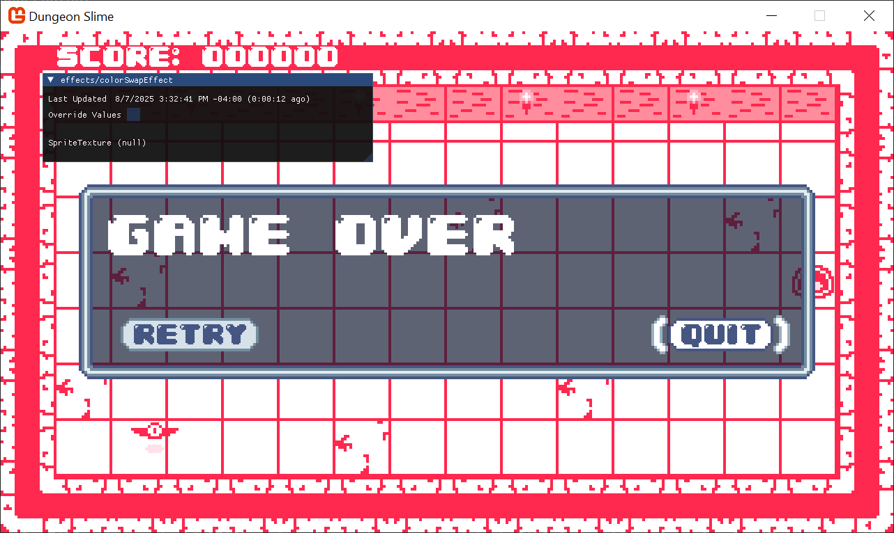
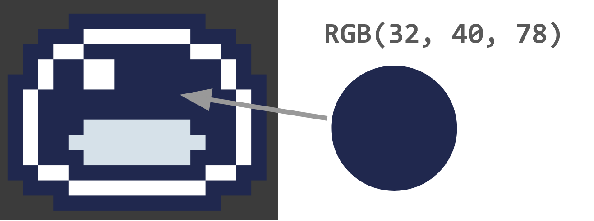
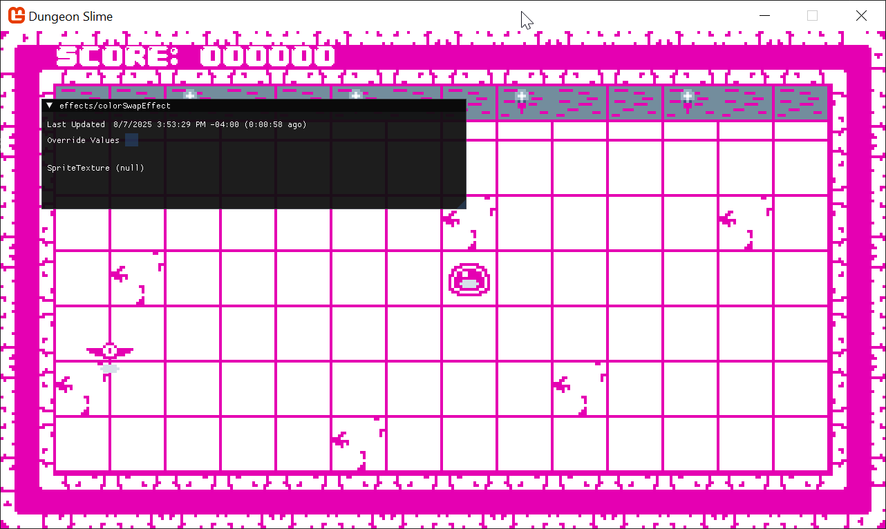
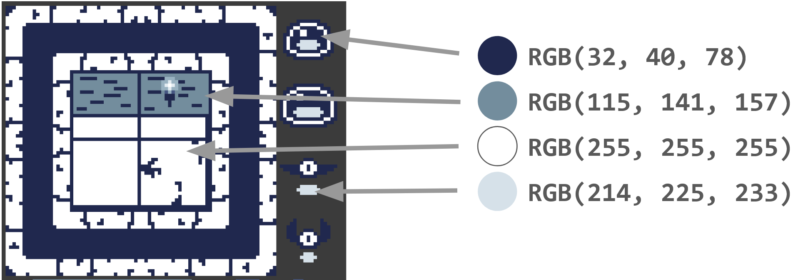
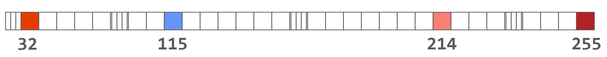

In the last chapter, you created a scene transition effect. In this chapter, you will create a color swapping effect that allows the game's color pallet to be changed dynamically at runtime!


## The Basic Color Swap Effect

At the moment, the game uses a lot of blue and gray textures. A common feature in retro-style games is to be able to change the color palette of the game. Another common feature of a game is to change the character's color during certain in-game events. For example, maybe the character flashes red or white when taking damage, or sparkles a gold color when picking up a combo. There are 2 broad categories for implementing these styles of features, 
1. re-draw all of the game assets using each color palette,
2. use some sort of _color swap_ shader effect to dynamically control the colors of sprites at runtime. 

For some simple use cases, sometimes it makes sense to simply re-draw the assets with different colors. However, the second option is more flexible and will enable more features, and since this is a shader tutorial, we will explore option 2. 

### Getting Started

Start by creating a new `Sprite Effect` in the _SharedContent_ MonoGame Content Builder file, and name it `colorSwapEffect.fx`. 

In the `GameScene`, we need to do the following steps to start working with the new `colorSwapEffect.fx`, 
1. Add a class variable for the new `Material` instance,
```csharp
// The color swap shader material.  
private Material _colorSwapMaterial;
```

2. Load the shader in the `LoadContent()` method,
```csharp
// Load the colorSwap material  
_colorSwapMaterial = Core.SharedContent.WatchMaterial("effects/colorSwapEffect");
_colorSwapMaterial.IsDebugVisible = true;
```

3. Update the `Material` in the `Update()` method to enable hot-reload support,
```csharp
_colorSwapMaterial.Update();
```

4. And finally, _use_ the `colorSwapMaterial` when drawing the sprites for the `GameScene`. For now, as we explore the color swapping effect, we are going to disable the `grayscaleEffect` functionality. In the `Draw()` method, start the `SpriteBatch` like this,
```csharp
if (_state != GameState.Playing)  
{  
    // We are in a game over state, so apply the saturation parameter.  
    _grayscaleEffect.SetParameter("Saturation", _saturation);  
  
    // And begin the sprite batch using the grayscale effect.  
    Core.SpriteBatch.Begin(samplerState: SamplerState.PointClamp, effect: _colorSwapMaterial.Effect);  
}  
else  
{  
    // Otherwise, just begin the sprite batch as normal.  
    Core.SpriteBatch.Begin(samplerState: SamplerState.PointClamp, effect: _colorSwapMaterial.Effect);  
}
```

Now when you run the game, it will look the same, but the new shader is being used to draw all the sprites in the `GameScene`. To verify, you can try changing the shader function to force the red channel to be `1`, just to see some visually striking confirmation the new shader is being used. 

```hlsl
float4 MainPS(VertexShaderOutput input) : COLOR  
{  
   float4 originalColor = tex2D(SpriteTextureSampler,input.TextureCoordinates) * input.Color;  
   originalColor.r = 1; // force the red-channel  
   return originalColor;  
}
```



> [!warning] The menu won't use the color swapper
> The game's menu is being drawn with GUM, and we aren't configuring any shaders on the GUM menu yet. For now, it will continue to draw with its old colors. 

For debugging purposes, we will disable the game's update logic so the player and bat aren't moving. This will let us focus on developing the look of the shader without getting distracted by the movement and game logic of game-over menus and score. 

The easiest way to disable all of the game logic is to `return` early from the `GameScene`'s `Update()` method, thus short circuiting all of the game logic.
```csharp
public override void Update(GameTime gameTime)  
{  
    // Ensure the UI is always updated  
    _ui.Update(gameTime);  
  
    // Update the grayscale effect if it was changed  
    _grayscaleEffect.Update();  
    _colorSwapMaterial.Update();  

	// Prevent the game from actually updating. TODO: remove this when we are done playing with shaders!
    return;

	// ...
```


### Hard Coding Color Swaps

The goal is be able to change the color of the sprites drawn with the `_colorSwapMaterial`. To build some intuition, one of the most straightforward ways to change the color is to hard-code a table of colors in the `colorSwapEffect.fx` file. The texture atlas used to draw the slime character uses a color value of `rgb(32, 40, 78)` for the body of the slime. 



The shader code _could_ just do an `if` check for this color, and when any of the texture reads are that color, return a hot-pink color instead. 

```hlsl
float4 MainPS(VertexShaderOutput input) : COLOR
{
	float4 originalColor = tex2D(SpriteTextureSampler,input.TextureCoordinates) * input.Color;
	
	// the color values are stored between 0 and 1, 
	//  this converts the 0 to 1 range to 0 to 255, and casts to an int.
	int red = originalColor.r * 255;
	int green = originalColor.g * 255;
	int blue = originalColor.b * 255;

	// check for the hard-coded blue color
	if (red == 32 && green == 40 && blue == 78)
	{
		float4 hotPink = float4(.9, 0, .7, 1);
		return hotPink;
	}

	return originalColor;
}
```

That would produce an image like this,


### Using a Color Map

The problem with this approach is that we would need to have an `if` check for _each_ color that should be swapped. Depending on your work ethic, there are already too many colors in the _Dungeon Slime_ assets to hardcode them all in a shader. Instead of hard coding the color swaps as `if` statements, we can create a _table_ of colors that maps asset color to final color. 

Conceptually, a _table_ structure is a series of `key` -> `value` pairs. We could represent each asset color as a `key`, and store the swap color as a `value`. To build up a good example, let's find a few more colors from the _Dungeon Slime_ assets. 



And here they are for copy-ability,
1. `rgb(32, 40, 78)`
2. `rgb(115, 141, 157)`
3. `rgb(255, 255, 255)`
4. `rgb(214, 225, 233)`

Our goal is to treat those colors as `keys` into a table that results in a final color `value`. Fortunately, all of the `red` channels are unique across all 4 input colors. The `red` channel are `32`, `115`, `255`, and `214`. 

As a demonstration, if we were using C# to create a table, it might look like this,

```csharp
var map = new Dictionary<int, Color>  
{  
	// picked some random colors for the values
    [32] = Color.MonoGameOrange,  
    [115] = Color.CornflowerBlue,  
    [255] = Color.Firebrick,  
    [214] = Color.Salmon  
};
```

Unfortunately, shaders do not support the `Dictionary<>` type, so we need to find another way to represent the table in a shader friendly format. Shaders are good at reading data from textures, so we will encode the table information inside a custom texture. Imagine a custom texture that was 256 pixels wide, but only 1 pixel _tall_. We could treat the `key` values from above (`32`, `115`, `255`, and `214`) as _locations_ along the x-axis of the image, and the color of each pixel as the `value`. 

This image is not to scale, because a 256 x 1 pixel image would not show well on a web browser. 


And here is _actually_ that image. Download [this image](./images/color-map-1.png) and add it to your MonoGame Content file.


We need to load and pass the the texture to the `colorSwapEffect` shader.
Add this code after loading the `_colorSwapMaterial` in the `LoadContent()` method
```csharp
var colorMap = Content.Load<Texture2D>("images/color-map-1");
_colorSwapMaterial.SetParameter("ColorMap", colorMap);
```

And the `colorSwapEffect.fx` shader needs to be updated to accept the color map,
```hlsl
// the main Sprite texture passed to SpriteBatch.Draw()
Texture2D SpriteTexture;
sampler2D SpriteTextureSampler = sampler_state
{
	Texture = <SpriteTexture>;
};

// the custom color map passed to the Material.SetParameter()
Texture2D ColorMap;
sampler2D ColorMapSampler = sampler_state
{
	Texture = <ColorMap>;
};
```

The `Texture2D ColorMap;` line introduces a new shader parameter that can be set from MonoGame. The `ColorMapSampler` is the structure that allows the shader to _read_ information from the `ColorMap`. 


## Color Look Up Textures (LUTs)

## Fixing the grayScale