In the previous chapter, you learned how to use custom vertex shaders with MonoGame `SpriteBatch`. In this chapter, we will focus on adding lighting to the _Dungeon Slime_ game. Our goal is to add more visual depth to the game.

## Deferred Rendering

So far, the game's rendering has been fairly straightforward. The game consists of a bunch of sprites, and all those sprites are drawn straight to the screen using a custom shader effect. Adding lights is going to complicate the rendering, because now each sprite must consider _N_ number of lights before being drawn to the screen. 

There are two broad categories of strategies for rendering lights in a game, 
1. _Forward_ rendering, and
2. _Deferred_ rendering. 

In the earlier days of computer graphics, forward renderers were ubiquitous. Imagine a simple 2d where there is a single sprite with 3 lights nearby. The sprite would be rendered 3 times, once for each light. Each individual pass would layer any existing passes with the next light. This technique is forward rendering, and there are many optimizations that make it fast and efficient. However, in a scene with lots of objects and lots of lights, each object needs to be rendered for each light, and the amount of rendering can scale poorly. The amount of work the renderer needs to do is roughly proportional to the number of sprites (`S`) multiped by the number of lights (`L`), or `S * L`. 

In the 2000's, the deferred rendering strategy was [introduced](https://sites.google.com/site/richgel99/the-early-history-of-deferred-shading-and-lighting) and popularized by games like [S.T.A.L.K.E.R](https://developer.nvidia.com/gpugems/gpugems2/part-ii-shading-lighting-and-shadows/chapter-9-deferred-shading-stalker). In deferred rendering, each object is drawn _once_ without _any_ lights to an off-screen texture. Then, each light is drawn on top of the off-screen texture. To make that possible, the initial rendering pass draws extra data about the scene into additional off-screen textures. Theoretically, a deferred renderer can handle more lights and objects because the work is roughly approximate to the sprites (`S`) _added_ to the lights (`L`), or `S + L`. 

Deferred rendering was popular for several years. MonoGame is an adaptation of XNA, which came out in the era of deferred rendering. However, deferred renderers are not a silver bullet for performance and graphics programming. The crux of a deferred renderer is to bake data into off-screen textures, and as monitor resolutions have gotten larger and larger, the 4k resolutions are starting to add too much overhead. Also, deferred renderers cannot handle transparent materials. Many big game projects use deferred rendering for _most_ of the scene, and a forward renderer for the final transparent components of the scene. As with all things, which type of rendering to use is a nuanced decision. There are new types of forward rendering strategies (see, [clustered rendering](https://github.com/DaveH355/clustered-shading)) that can out perform deferred renderers. However, for our use cases, the deferred rendering technique is sufficient. 

## Modifying the Game

Writing a simple deferred renderer can be worked out in a few steps, 
1. take the scene as we are drawing it currently, and store it in an off-screen texture. This texture is often called the diffuse texture, or color texture.
2. render the scene again, but instead of drawing the sprites normally, draw their _Normal_ maps to an off-screen texture, called the normal texture.
3. create a new off-screen texture, called the light texture, where each light is layered on-top of each other,
4. finally, create a rendering to the screen based on the lighting texture and the color texture.

The second stage references a new term, called the _Normal_ Map. We will come back to this later in the chapter. For now, we will focus on the other steps. 

### Drawing to an off-screen texture

To get started, we need to draw the main game sprites to an off-screen texture instead of directly to the screen. Create a new file in the shared _MonoGameLibrary_ graphics folder called `DeferredRenderer.cs`. 

```csharp
using Microsoft.Xna.Framework;
using Microsoft.Xna.Framework.Graphics;

namespace MonoGameLibrary.Graphics;

public class DeferredRenderer
{
    /// <summary>
    /// A texture that holds the unlit sprite drawings
    /// </summary>
    public RenderTarget2D ColorBuffer { get; set; }

    public DeferredRenderer()
    {
        var viewport = Core.GraphicsDevice.Viewport;
        
        ColorBuffer = new RenderTarget2D(
            graphicsDevice: Core.GraphicsDevice, 
            width: viewport.Width,
            height: viewport.Height,
            mipMap: false,
            preferredFormat: SurfaceFormat.Color, 
            preferredDepthFormat: DepthFormat.None);

    }
}
```

The `ColorBuffer` property is a `RenderTarget2D`, which is a special of type of `Texture2D` that MonoGame can draw into. In order for MonoGame to draw anything into the `ColorBuffer`, it needs to be bound as the current render target. Add the following function to the `DeferredRenderer` class. The `SetRenderTarget()` function instructs all future MonoGame draw operations to render into the `ColorBuffer`. 

```csharp
public void StartColorPhase()  
{  
    // all future draw calls will be drawn to the color buffer  
    Core.GraphicsDevice.SetRenderTarget(ColorBuffer);  
    Core.GraphicsDevice.Clear(Color.Transparent);  
}
```

Once all of the rendering is complete, we need to switch the primary render target back to the _screen_ so that we can actually see anything. Add the following method to the `DeferredRenderer` class. Note that `null` is a special value when it comes to `RenderTarget2D`s. `null` translates to "the screen". 
```csharp
public void Finish()
{
	// all future draw calls will be drawn to the screen
	//  note: 'null' means "the screen" in MonoGame
	Core.GraphicsDevice.SetRenderTarget(null);
}
```

Now we can use this new off-screen texture in the `GameScene`. Add a new class member in the `GameScene` ,
```csharp
// The deferred rendering resources  
private DeferredRenderer _deferredRenderer;
```

And initialize it in the `Initialize()` method,
```csharp
// Create the deferred rendering resources  
_deferredRenderer = new DeferredRenderer();
```

Then, to actually _use_ the new off-screen texture, we need to invoke the `StartColorPhase()` and `Finish()` methods in the `Draw()` method of the `GameScene`. Right before the `SpriteBatch.Begin()` class, invoke the `StartColorPhase()` method. Here is the `Draw()` method with most of the code left out, but it demonstrates where the `StartColorPhase()` and `Finish()` methods belong,

```csharp

    public override void Draw(GameTime gameTime)
    {
        // ... configure the sprite batch 
        
        // Start rendering to the deferred renderer
        _deferredRenderer.StartColorPhase();
        Core.SpriteBatch.Begin(
            samplerState: SamplerState.PointClamp,
            sortMode: SpriteSortMode.Immediate,
            rasterizerState: RasterizerState.CullNone,
            effect: _gameMaterial.Effect);

		// ... all of the actual draw code.
		
        // Always end the sprite batch when finished.
        Core.SpriteBatch.End();
        _deferredRenderer.Finish();

        // Draw the UI
        _ui.Draw();
    }
```

If you run the game now, the game will appear blank except for the UI. That is because the game is rendering to an off-screen texture, but nothing is rendering the off-screen texture _back_ to the screen. For now, we will add some diagnostic visualization of the off-screen texture. Add the following function to the `DeferredRenderer` class. This function starts a new sprite batch and draws the `ColorBuffer` to the top-left corner of the screen, with an orange border around it to indicate it is a debug visualization.
```csharp
public void DebugDraw()
{
	var viewportBounds = Core.GraphicsDevice.Viewport.Bounds;
	
	// the debug view for the color buffer lives in the top-left.
	var colorBorderRect = new Rectangle(
		x: viewportBounds.X, 
		y: viewportBounds.Y, 
		width: viewportBounds.Width / 2,
		height: viewportBounds.Height / 2);
	
	// shrink the color rect by 8 pixels
	var colorRect = colorBorderRect;
	colorRect.Inflate(-8, -8);
	
	Core.SpriteBatch.Begin();
	
	// draw a debug border
	Core.SpriteBatch.Draw(Core.Pixel, colorBorderRect, Color.MonoGameOrange);
	
	// draw the color buffer
	Core.SpriteBatch.Draw(ColorBuffer, colorRect, Color.White);
	
	Core.SpriteBatch.End();
}
```

And call this method from end the `Draw()` method, after the GUM UI draws.
```csharp
// Render the debug view for the game  
_deferredRenderer.DebugDraw();
```

Now when you run the game, you should see the game appearing in the upper-left corner of the screen.
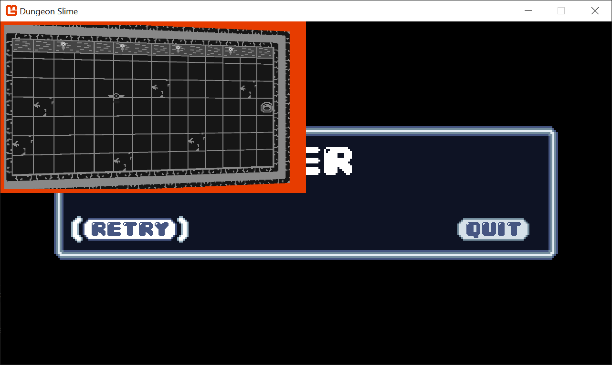

### Setting up the Light Buffer

The next step is to create some lights and render them to a second off-screen texture. To start, add a second `RenderTarget2D` property to the `DeferredRenderer` class.
```csharp
/// <summary>  
/// A texture that holds the drawn lights  
/// </summary>  
public RenderTarget2D LightBuffer { get; set; }
```

And initialize it in the constructor exactly the same as the `ColorBuffer` was initialized,
```csharp
LightBuffer = new RenderTarget2D(
	graphicsDevice: Core.GraphicsDevice, 
	width: viewport.Width,
	height: viewport.Height,
	mipMap: false,
	preferredFormat: SurfaceFormat.Color, 
	preferredDepthFormat: DepthFormat.None);
```

We need another method to switch MonoGame into drawing sprites onto the new off-screen texture,
```csharp
public void StartLightPhase()  
{  
    // all future draw calls will be drawn to the light buffer  
    Core.GraphicsDevice.SetRenderTarget(LightBuffer);  
    Core.GraphicsDevice.Clear(Color.Black);  
}
```

Then, we need to call the new method in the `GameScene`'s `Draw()` method between the current `SpriteBatch.End()` call and the `deferredRenderer.Finish()` call. 
```csharp
// Always end the sprite batch when finished.  
Core.SpriteBatch.End();  
  
// start rendering the lights  
_deferredRenderer.StartLightPhase();  
  
// TODO: draw lights  
  
// finish the deferred rendering  
_deferredRenderer.Finish();
```

To finish off with the `DeferredRenderer` changes for now, add the `LightBuffer` to the `DebugDraw()` view as well, 
```csharp
public void DebugDraw()
{
	var viewportBounds = Core.GraphicsDevice.Viewport.Bounds;
	
	// the debug view for the color buffer lives in the top-left.
	var colorBorderRect = new Rectangle(
		x: viewportBounds.X, 
		y: viewportBounds.Y, 
		width: viewportBounds.Width / 2,
		height: viewportBounds.Height / 2);
	
	// shrink the color rect by 8 pixels
	var colorRect = colorBorderRect;
	colorRect.Inflate(-8, -8);
	
	
	// the debug view for the light buffer lives in the top-right.
	var lightBorderRect = new Rectangle(
		x: viewportBounds.Width / 2, 
		y: viewportBounds.Y, 
		width: viewportBounds.Width / 2,
		height: viewportBounds.Height / 2);
	
	// shrink the light rect by 8 pixels
	var lightRect = lightBorderRect;
	lightRect.Inflate(-8, -8);

	
	Core.SpriteBatch.Begin();
	
	// draw a debug border
	Core.SpriteBatch.Draw(Core.Pixel, colorBorderRect, Color.MonoGameOrange);
	
	// draw the color buffer
	Core.SpriteBatch.Draw(ColorBuffer, colorRect, Color.White);
	
	//draw a debug border
	Core.SpriteBatch.Draw(Core.Pixel, lightBorderRect, Color.CornflowerBlue);
	
	// draw the light buffer
	Core.SpriteBatch.Draw(LightBuffer, lightRect, Color.White);
	
	Core.SpriteBatch.End();
}
```

Now when you run the game, you'll see a blank texture in the top-right. It is blank because there are no lights yet.
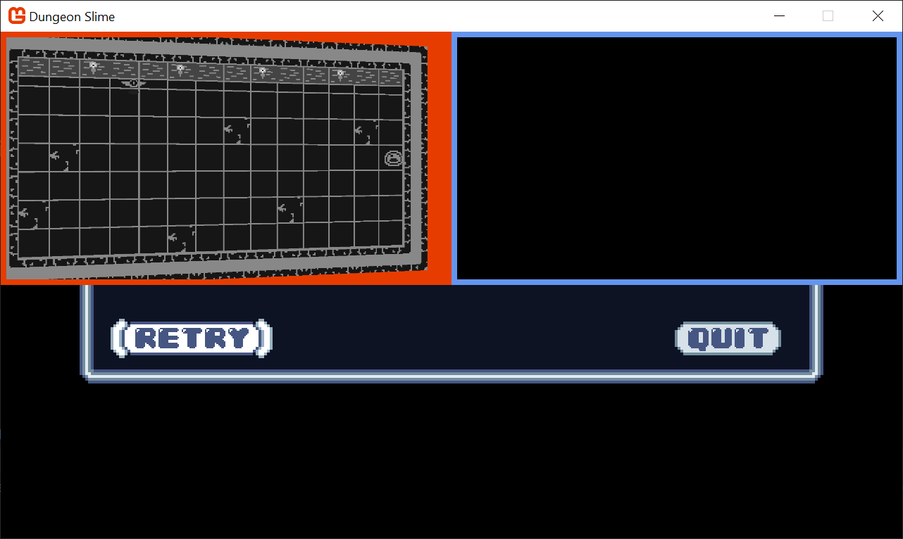

### Point Light Shader

Each light will be drawn using a shader so that the fall-off and intensity can be adjusted in real time. Use the `mgcb-editor` to create a new Sprite Effect in the _SharedContent_ folder. For now, leave it as the default shader. We need to load it in the `Core` class. First, create a new class member in the `Core` class, 

```csharp
/// <summary>  
/// The material that draws point lights  
/// </summary>  
public static Material PointLightMaterial { get; private set; }
```

And then load the `Material` in the `LoadContent()` method.
```csharp
PointLightMaterial = SharedContent.WatchMaterial("effects/pointLightEffect");
```

And don't forget to enable the hot-reload by adding the `Update()` line in the `Update()` method.
```csharp
PointLightMaterial.Update();
```


In order to handle multiple lights, it will be helpful to have a class to represent each light. Create a new file in the _MonoGameLibrary_'s graphics folder called `PointLight.cs`. 

```csharp
using System.Collections.Generic;
using Microsoft.Xna.Framework;
using Microsoft.Xna.Framework.Graphics;

namespace MonoGameLibrary.Graphics;

public class PointLight
{
    /// <summary>
    /// The position of the light in world space
    /// </summary>
    public Vector2 Position { get; set; }

    /// <summary>
    /// The color tint of the light
    /// </summary>
    public Color Color { get; set; } = Color.White;

    /// <summary>
    /// The radius of the light in pixels
    /// </summary>
    public int Radius { get; set; } = 250;
}
```

Now, create a `List<PointLight>` as a new class member in the `GameScene`. 
```csharp
// A list of point lights to be rendered  
private List<PointLight> _lights = new List<PointLight>();
```

In order to start building intuition for the point light shader, we need a debug light to experiment with. Add this snippet to the `GameScene`'s `Initialize()` method,
```csharp
_lights.Add(new PointLight  
{  
    Position = new Vector2(300,300)  
});
```

We need to draw the `PointLight` list using the new `PointLightMaterial`. Add the following function the `PointLight` class.
```csharp
public static void Draw(SpriteBatch spriteBatch, List<PointLight> pointLights)
{
	spriteBatch.Begin(
		effect: Core.PointLightMaterial.Effect
		);
	
	foreach (var light in pointLights)
	{
		var diameter = light.Radius * 2;
		var rect = new Rectangle((int)(light.Position.X - light.Radius), (int)(light.Position.Y - light.Radius), diameter, diameter);
		spriteBatch.Draw(Core.Pixel, rect, light.Color);
	}
	
	spriteBatch.End();
}
```

And call it from the `GameScene`'s `Draw()` method after the `StartLightPhase()` invocation.
```csharp
PointLight.Draw(Core.SpriteBatch, _lights);
```

Now when you run the game, you will see a blank white square where the point light is located (at 300,300). 

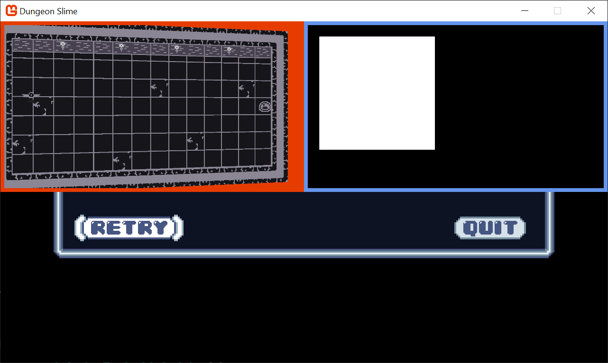

The next task is to write the `pointLightEffect.fx` shader file so that the white square looks more like a point light. There are several ways to create the effect, some more realistic than others. For _DungeonSlime_, a realistic light fall off isn't going to look great, so we will develop something custom. 

To start, calculate the distance from the center of the image, and render the distance as the red-channel.
```hlsl
float4 MainPS(VertexShaderOutput input) : COLOR  
{  
    float dist = length(input.TextureCoordinates - .5);     
    return float4(dist, 0, 0, 1);  
}
```

For the sake of these clarity, these screenshots show only the `LightBuffer` as full screen. Here, we can see the distance based return value.
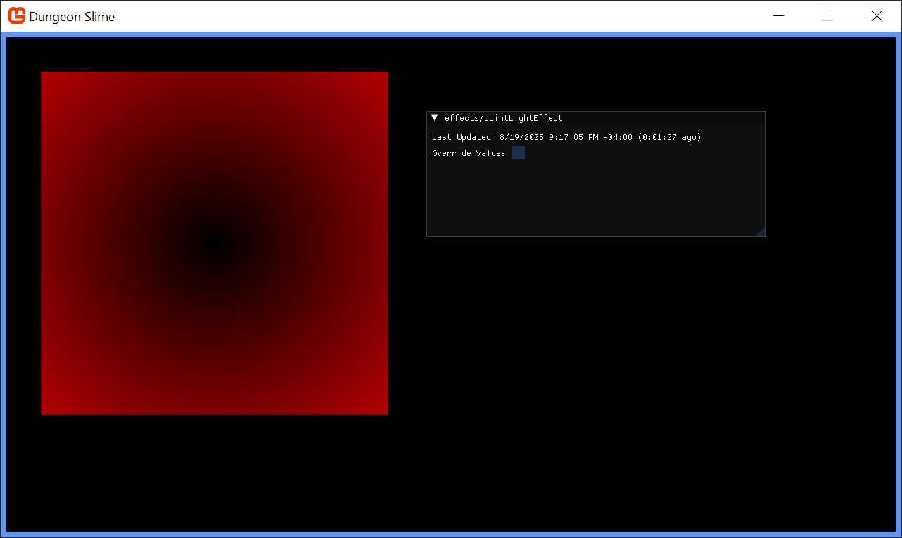

That starts to look like a light, but in reverse. Create a new variable, `falloff` which inverts the distance. The `saturate` function is shorthand for clamping the value between `0` and `1`. 

```hlsl
float4 MainPS(VertexShaderOutput input) : COLOR  
{  
    float dist = length(input.TextureCoordinates - .5);     
    
    float falloff = saturate(.5 - dist);  

    return float4(falloff, 0, 0, 1);  
      
}
```

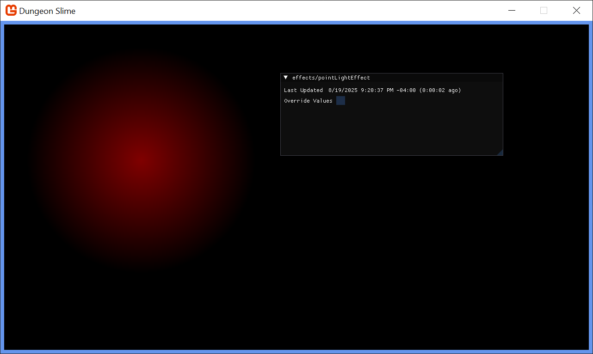

That looks more light-like. Now it is time to add some artistic control parameters to the shader. First, it would be good to be able to increase the brightness of the light. Multiplying the `falloff` by some number larger than 1 would increase the brightness, but leave the unlit sections completely unlit. 

```hlsl
float LightBrightness;  
  
float4 MainPS(VertexShaderOutput input) : COLOR  
{  
    float dist = length(input.TextureCoordinates - .5);     
    
    float falloff = saturate(.5 - dist) * (LightBrightness + 1);  
     
    return float4(falloff, 0, 0, 1);  
      
}
```

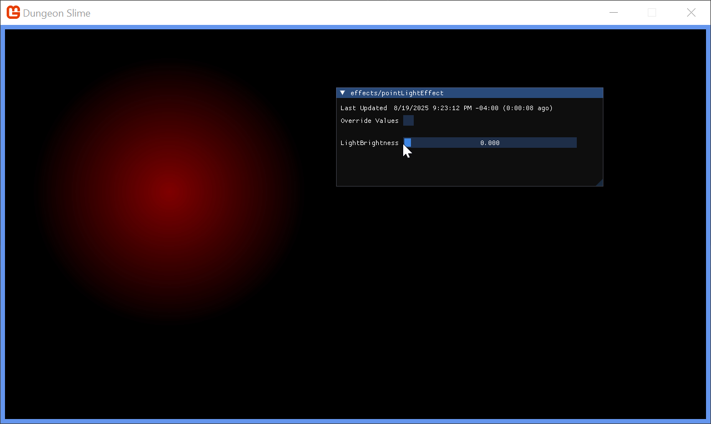

It would also be good to control the sharpness of the fall off. The `pow()` function raises the `falloff` to some exponent value.
```hlsl
float LightBrightness;  
float LightSharpness;  
  
float4 MainPS(VertexShaderOutput input) : COLOR  
{  
    float dist = length(input.TextureCoordinates - .5);     
    
    float falloff = saturate(.5 - dist) * (LightBrightness + 1);  
    falloff = pow(falloff, LightSharpness + 1);  
     
    return float4(falloff, 0, 0, 1);  
    
}
```

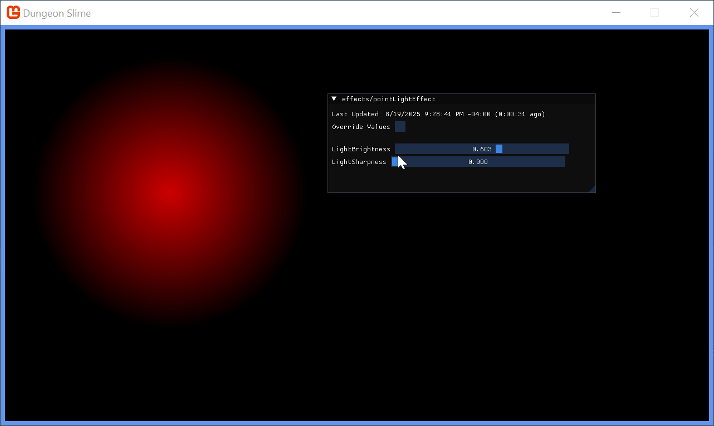

Finally, the shader parameters from `0` to `1`, but it would be nice to push the brightness and sharpness beyond `1`. Add a `range` multiplier in the shader code.

```hlsl
float LightBrightness;  
float LightSharpness;  
  
float4 MainPS(VertexShaderOutput input) : COLOR  
{  
    float dist = length(input.TextureCoordinates - .5);     
    
    float range = 5; // arbitrary maximum.   
    
    float falloff = saturate(.5 - dist) * (LightBrightness * range + 1);  
    falloff = pow(falloff, LightSharpness * range + 1);  
     
    return float4(falloff, 0, 0, 1);  
}
```


The final touch is to return the `Color` of the light, instead of the red debug value. The `input.Color` carries the `Color` passed through the `SpriteBatch`, so we can use that. Multiply the alpha channel of the color by the `falloff` to _fade_ the light out without changing the light color itself.

```hlsl
float LightBrightness;  
float LightSharpness;  
  
float4 MainPS(VertexShaderOutput input) : COLOR  
{  
    float dist = length(input.TextureCoordinates - .5);     
    
    float range = 5; // arbitrary maximum.   
    
    float falloff = saturate(.5 - dist) * (LightBrightness * range + 1);  
    falloff = pow(falloff, LightSharpness * range + 1);  
     
    float4 color = input.Color;  
    color.a = falloff;  
    return color;  
}
```

Change the light color in C# to `CornflowerBlue`. 
```csharp
_lights.Add(new PointLight  
{  
    Position = new Vector2(300,300),  
    Color = Color.CornflowerBlue  
});
```

And change the `blendState` of the light's `SpriteBatch` draw call to additive,
```csharp
spriteBatch.Begin(  
    effect: Core.PointLightMaterial.Effect,  
    blendState: BlendState.Additive  
    );
```

Set the shader parameter values for brightness and sharpness to something you like,
```csharp
PointLightMaterial = SharedContent.WatchMaterial("effects/pointLightEffect");  
PointLightMaterial.IsDebugVisible = true;  
PointLightMaterial.SetParameter("LightBrightness", .25f);  
PointLightMaterial.SetParameter("LightSharpness", .1f);
```

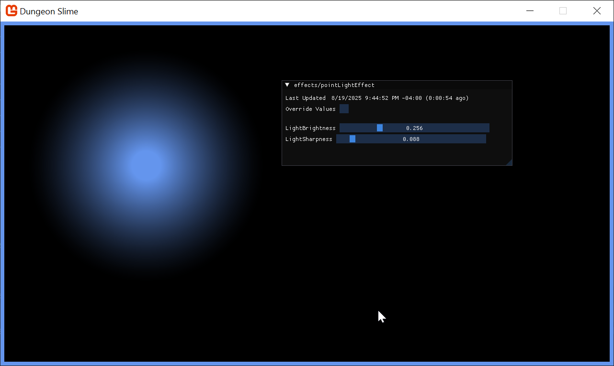

The light looks good! When we revert the full-screen `LightBuffer` and render the `LightBuffer` next to the `ColorBuffer`, a graphical bug will become clear. The world in the `ColorBuffer` is rotating with the vertex shader from the previous chapter, but the `LightBuffer` doesn't have the same effect, so the light appears broken. 


### Combining Light and Color 

Now that the light and color buffers are being drawn to separate off screen textures, we need to _composite_ them to create the final screen render. Create a new Sprite Effect in the shared content folder called `deferredCompositeEffect.fx`. 

Create a new class member in the `Core` class to hold the material,
```csharp
/// <summary>  
/// The material that combines the various off screen textures  
/// </summary>  
public static Material DeferredCompositeMaterial { get; private set; }
```

And load the effect in the `LoadContent()` method of the `Core` class. 
```csharp
DeferredCompositeMaterial = SharedContent.WatchMaterial("effects/deferredCompositeEffect");  
DeferredCompositeMaterial.IsDebugVisible = true;
```

To enable hot-reload support, add the `Update()` method,
```csharp
DeferredCompositeMaterial.Update();
```

Create a new method in the `DeferredRenderer` class that will draw the composited image.
```csharp
public void DrawComposite()
{
	var viewportBounds = Core.GraphicsDevice.Viewport.Bounds;
	Core.SpriteBatch.Begin(
		effect: Core.DeferredCompositeMaterial.Effect
		);
	Core.SpriteBatch.Draw(ColorBuffer, viewportBounds, Color.White);
	Core.SpriteBatch.End();   
}
```

And instead of calling the `DebugDraw()` from the `GameScene`, call the new method before the GUM UI is drawn.
```csharp
_deferredRenderer.Finish();  
_deferredRenderer.DrawComposite();
```

If you run the game now, it will appear as it did when we started the chapter! Now it is time to factor in the `LightBuffer`. The `deferredCompositeEffect` shader needs to get the `LightBuffer` and multiply it with the `ColorBuffer`. The `ColorBuffer` is being passed in as the main sprite from `SpriteBatch`, so we will need to add a second texture and sampler to the shader to get the `LightBuffer`. 

```hlsl
Texture2D LightBuffer;  
sampler2D LightBufferSampler = sampler_state  
{  
   Texture = <LightBuffer>;  
};
```

In the `DeferredRenderer` class, in the `DrawComposite` function before the sprite batch starts, make sure to pass the `LightBuffer` to the material.
```csharp
Core.DeferredCompositeMaterial.SetParameter("LightBuffer", LightBuffer);
```

The main pixel function for the shader reads both the color and light values and returns their product. 
```hlsl
float4 MainPS(VertexShaderOutput input) : COLOR
{
	float4 color = tex2D(SpriteTextureSampler,input.TextureCoordinates) * input.Color;
	float4 light = tex2D(LightBufferSampler,input.TextureCoordinates) * input.Color;

    return color * light;
}
```

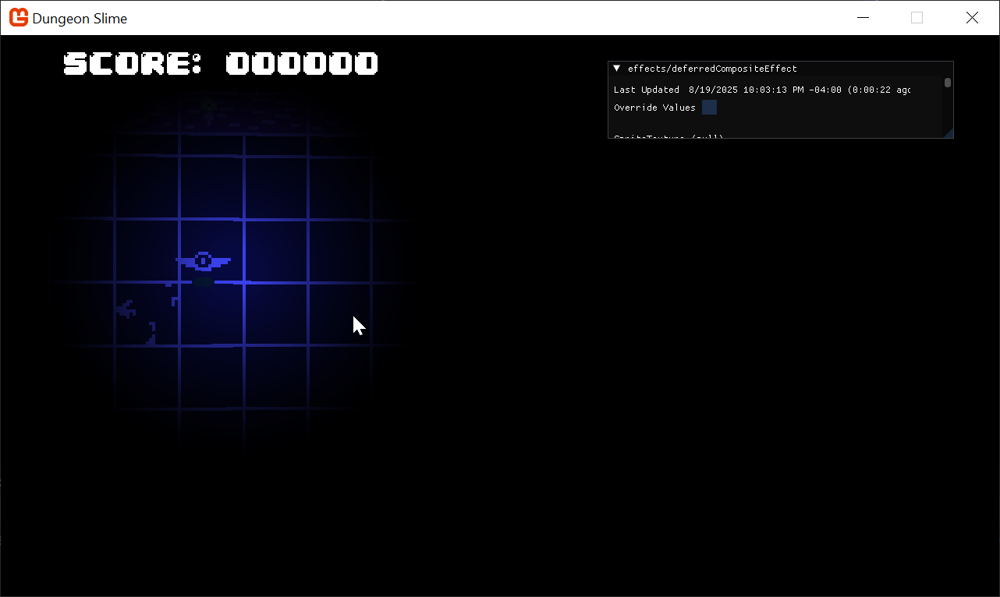

The light is working! However, the whole scene is too dark to see what is going on or play the game. To solve this, we can add a small amount of ambient light. 
```hlsl
float AmbientLight;

float4 MainPS(VertexShaderOutput input) : COLOR
{
	float4 color = tex2D(SpriteTextureSampler,input.TextureCoordinates) * input.Color;
	float4 light = tex2D(LightBufferSampler,input.TextureCoordinates) * input.Color;

    light = saturate(light + AmbientLight);
    return color * light;
}
```

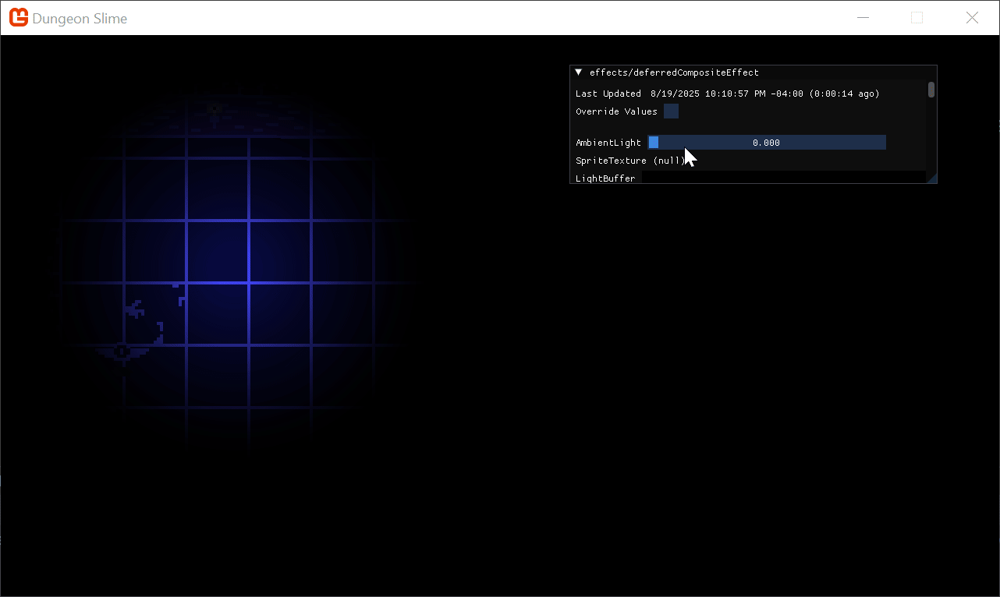

Find a value of ambient that you like and set the parameter from code.
```csharp
public void DrawComposite(float ambient=.4f)  
{  
    Core.DeferredCompositeMaterial.SetParameter("AmbientLight", ambient);
    // ... 
```

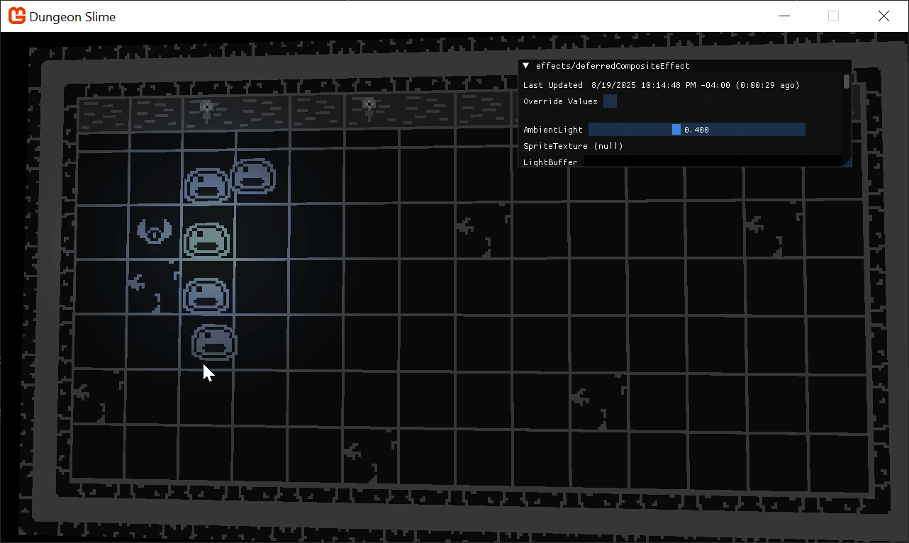

TODO;
- vertex shader correction
- blending multiple lights with High Definition 
- Normals
- Moving lights and gameplay